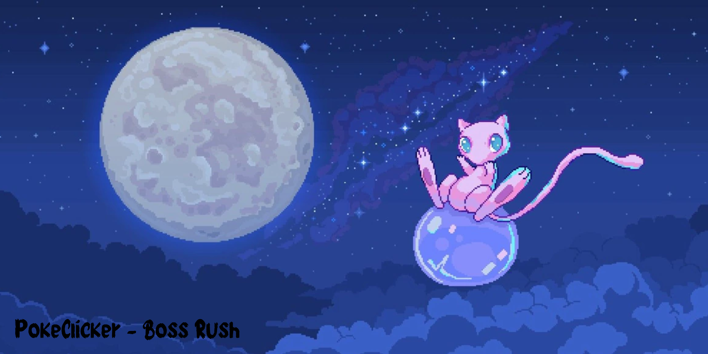

<p align="center">
  
</p>

<h1 align="center">PokeClicker - Boss Rush</h1>

<p align="center">
  Um jogo estilo clicker no navegador onde você enfrenta Pokémon em tempo real, compra melhorias e monta sua própria Pokédex usando dados reais da PokéAPI.
</p>

---

## Sobre o projeto

O **PokeClicker - Boss Rush** é um joguinho estilo clicker feito em HTML, CSS e JavaScript puro (sem frameworks ou coisas complicadas). A ideia principal é simples: você entra em uma arena e tem um tempo limite para derrotar o Pokémon selvagem que aparecer na tela clicando nele o mais rápido possível.

O legal é que o jogo consome a **PokéAPI**, então toda batalha é surpresa. Você pode encontrar qualquer Pokémon da 1ª até a 5ª geração, com as imagens oficiais e com a vida do boss calculada baseada nos status reais de cada monstrinho.

Se o tempo acabar antes de você zerar a barra de vida dele, o Pokémon foge e outro aparece no lugar. Se você vencer, ganha moedas para gastar na loja e o Pokémon é registrado automaticamente na sua Pokédex personalizável.

---

## O que tem no jogo

* **Batalhas contra o tempo (Boss Rush):** Você tem 45 segundos para vencer cada batalha. É preciso clicar rápido e saber a hora certa de comprar melhorias!
* **Vida e recompensas dinâmicas:** A quantidade de vida dos inimigos e as moedas que você ganha dependem da força real de cada Pokémon lá na API.
* **Sistema de Acerto Crítico:** Ao clicar, você tem chance de dar um ataque crítico que causa 3x mais dano! Quando acontece, a tela treme e aparece um aviso na arena.
* **Números flutuantes:** Cada clique mostra o dano subindo na tela exatamente onde o seu mouse estava, dando uma sensação muito bacana de impacto.
* **Loja de Melhorias completa:** Conforme junta moedas, você pode gastar em 12 upgrades diferentes divididos em 4 tipos:
  * Aumentar o seu dano por clique.
  * Contratar ajudantes (Pikachu, Charizard, Pidgeot, Mewtwo) para dar dano automático por segundo (CPS).
  * Ganhar mais tempo no cronômetro do boss (itens como Quick Claw e Trick Room).
  * Aumentar o ganho de moedas e a sua chance de dar crítico.
* **Sua própria Pokédex:** Dá para ver quantos Pokémon você já capturou, pesquisar pelo nome em tempo real, clicar em cada um para ver as estatísticas base (Ataque, Defesa, etc.) e até favoritar os seus preferidos.
* **Salvamento automático:** O jogo salva o seu progresso no navegador a cada 10 segundos. Você pode fechar a aba, ir fazer outra coisa e quando voltar suas moedas e sua Pokédex estarão lá.

---

## Como foi feito

Esse projeto foi construído do zero para um desafio aplicado por uma professora, as ferramentas usadas incluem:

* **HTML5:** Para montar toda a estrutura do site, da arena de batalha até os modais da Pokédex.
* **CSS3:** Para deixar o visual limpo, responsivo (funciona bem em telas menores) e fazer as animações dos cliques e do texto flutuando.
* **JavaScript:** É o cérebro do jogo. Controla o cronômetro, a lógica de compra da loja, a barra de vida, o salvamento no localStorage e a comunicação com a API dos Pokémon.
* **PokéAPI:** A API gratuita e aberta que fornece os dados, nomes, tipos e sprites (imagens) dos Pokémon.

---

## Como jogar no seu PC

Você não precisa instalar nenhum programa complexo ou servidor para rodar o jogo no seu computador. Só precisa de um navegador web comum.

1. Baixe os arquivos do projeto aqui do GitHub (ou faça o clone com o comando abaixo no terminal):
   ```bash
   git clone https://github.com/SeuUsuario/PokeClicker---Boss-Rush.git
   ```
2. Abra a pasta do projeto no seu computador:
   ```bash
   cd PokeClicker---Boss-Rush
   ```
3. Dê dois cliques no arquivo `index.html` para abrir direto no seu navegador (Chrome, Edge, Firefox, etc.).
4. Se você estiver usando o VS Code, pode usar a extensão **Live Server** para abrir o projeto com recarregamento automático.

Prontinho, já pode começar a clicar.

---

## O que vem por aí (Próximos passos)

Como o projeto está sempre evoluindo, aqui estão algumas coisas que pretendo adicionar no futuro:

* Adicionar efeitos sonoros para os ataques, compras na loja e músicas de fundo para a batalha.
* Colocar mais fundos de arena e GIFs temáticos para deixar o visual ainda mais imersivo.
* Criar um sistema de conquistas (por exemplo: derrotar 100 chefes, juntar 10.000 moedas, capturar 50 Pokémon).
* Adicionar um filtro para você escolher qual geração de Pokémon quer enfrentar na arena.

---

## Aviso legal

Este é um projeto de estudos e sem fins lucrativos feito por fã. Pokémon e os nomes dos personagens são marcas registradas da Nintendo, Game Freak e Creatures Inc.
